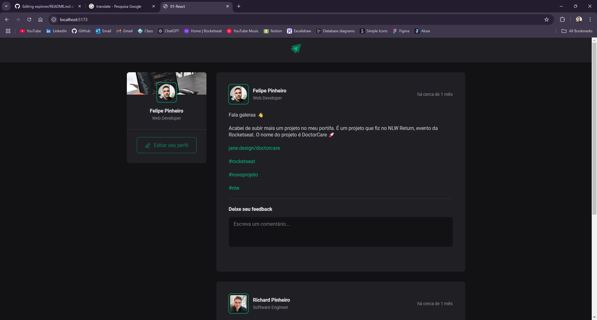
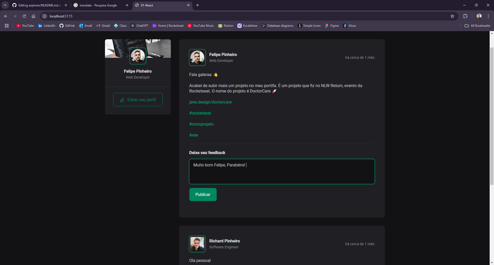
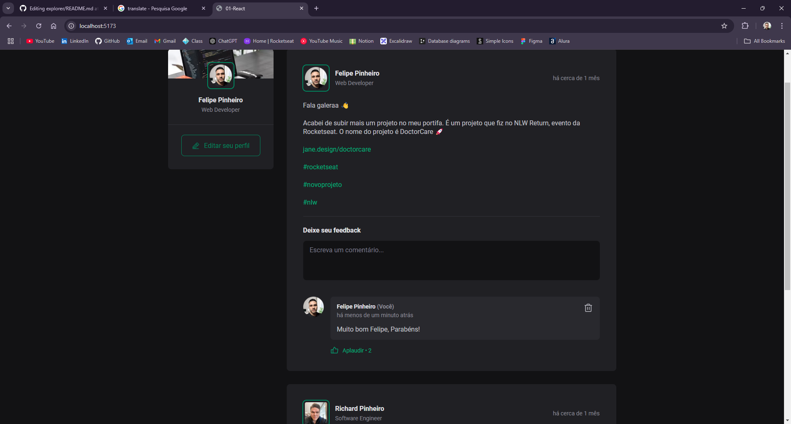

# Social Software

Este projeto é uma aplicação de rede social desenvolvida com **React**, **TypeScript** e **Vite**. O objetivo é demonstrar conceitos modernos de desenvolvimento front-end, incluindo componentização, estilização modular, manipulação de estado e boas práticas de organização de código.


<hr>


<hr>



## ✨ Tecnologias Utilizadas

- [React](https://react.dev/) — Biblioteca para construção de interfaces de usuário.
- [TypeScript](https://www.typescriptlang.org/) — Superset do JavaScript com tipagem estática.
- [Vite](https://vitejs.dev/) — Ferramenta de build e servidor de desenvolvimento rápido.
- [date-fns](https://date-fns.org/) — Manipulação e formatação de datas.
- [@phosphor-icons/react](https://phosphoricons.com/) — Ícones personalizáveis para React.
- [ESLint](https://eslint.org/) — Linter para garantir qualidade e padronização do código.
- [CSS Modules](https://github.com/css-modules/css-modules) — Estilização modular e escopada por componente.

## 📁 Estrutura de Pastas

```
src/
  assets/           # Imagens e SVGs
  components/       # Componentes reutilizáveis (Avatar, Comment, Header, Post, SideBar)
  pages/            # Páginas principais da aplicação
  posts.ts          # Mock de dados dos posts
  main.tsx          # Ponto de entrada da aplicação React
  index.css         # Estilos globais
```

## 🚀 Como rodar localmente

### Pré-requisitos

- [Node.js](https://nodejs.org/) (recomendado v18+)
- [npm](https://www.npmjs.com/) ou [yarn](https://yarnpkg.com/)

### Passos

1. **Clone o repositório:**
   ```sh
   git clone <url-do-repositorio>
   cd 01-react-ts
   ```

2. **Instale as dependências:**
   ```sh
   npm install
   # ou
   yarn
   ```

3. **Inicie o servidor de desenvolvimento:**
   ```sh
   npm run dev
   # ou
   yarn dev
   ```

4. **Acesse no navegador:**
   ```
   http://localhost:5173
   ```
   O endereço pode variar, verifique o terminal após rodar o comando.

### Outros comandos úteis

- **Build para produção:**
  ```sh
  npm run build
  ```
- **Preview do build:**
  ```sh
  npm run preview
  ```
- **Lint do código:**
  ```sh
  npm run lint
  ```

## 🧩 Principais Componentes

- `Header`: Cabeçalho com logo.
- `SideBar`: Barra lateral com perfil do usuário.
- `Post`: Exibe posts, comentários e formulário de feedback.
- `Comment`: Comentários dos posts.
- `Avatar`: Avatar do usuário.

## 📝 Funcionalidades

- Listagem de posts com informações do autor, data e conteúdo.
- Adição e remoção de comentários em cada post.
- Contador de "aplausos" (likes) em comentários.
- Estilização responsiva e modularizada com CSS Modules.
- Datas formatadas em português (pt-BR) usando date-fns.

## 💡 Dicas e Observações

- O projeto utiliza dados mockados em `src/posts.ts`.
- Para alterar o usuário do perfil da sidebar, edite o componente correspondente.
- Os comentários são armazenados apenas em memória (não persistem ao recarregar a página).
- O projeto já está configurado com ESLint para garantir boas práticas de código.

## 📄 Licença

Este projeto é apenas para fins de estudo e demonstração.

---

Feito com React, TypeScript e Vite.